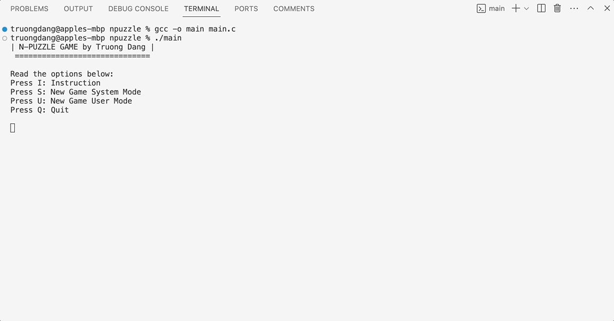
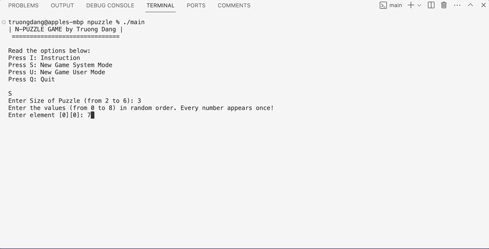
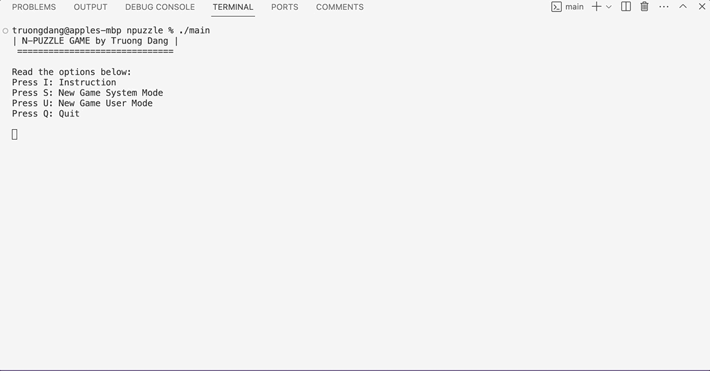
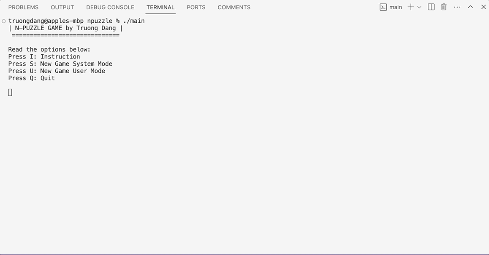

# N-Puzzle Game 
*Using A\* Search Algorithm and C Programming*

## About Sliding Puzzle Game

For easier understanding, the 15 Puzzle is a sliding puzzle. It has 15 square tiles numbered 1 to 15 in a frame that is 4 tile positions high and 4 tile positions wide, with one unoccupied position (tile 0). Tiles in the same row or column of the open position can be moved by sliding them horizontally or vertically, respectively. The goal of the puzzle is to place the tiles in numerical order (from left to right, top to bottom).

More: [https://en.wikipedia.org/wiki/Sliding_puzzle](https://en.wikipedia.org/wiki/Sliding_puzzle)

## About A* Search Algorithm

A* is a graph traversal and pathfinding algorithm, which is used in many fields of Computer Science because of its completeness, optimality, and optimal efficiency. Given a weighted graph, an initial node and a goal node, the algorithm finds the shortest path (with respect to the given weights) from source to goal.

## Result



#### Computer Plays





#### User Plays



## Installation

- Clone/Download project
- Open IDE (Visual Studio Code)
- Install C/C++ extensions

```
gcc -o main main.c
./main
```
